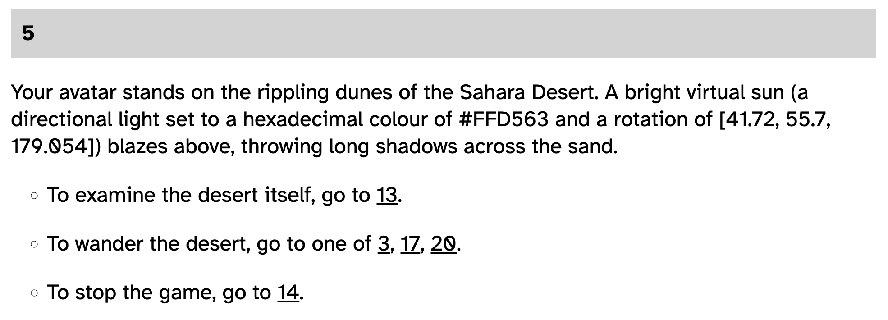

# *Curate Your Own Art Game*

## [Play Online (English)](https://www.pippinbarr.com/curate-your-own-art-game/?lang=en) (desktop and mobile)

## [Play Online (Français)](https://www.pippinbarr.com/curate-your-own-art-game/?lang=fr) (desktop and mobile)

## Description

*Let's make a game! Let's think about making a game! A game about making games! Let's play a Choose Your Own Adventure about making a game about games where you're me! I'm not confused! Neither are we!*

*Curate Your Own Art Game* is a Choose Your Own Adventure (CYOA) Essay, first published on actual paper in *[ART X GAME = JEU X ART =](https://www.leslibraires.ca/livres/art-x-game-jeu-x-game-9782924589205.html)*, edited by Nathalie Bachand and Lynn Hughes and published by Éditions OQP for Sporobole in 2022. The book is in both English and French and my essay was translated into French by Bernard Andreas Schutze.

This online version of the essay simply makes the paper version interactive, allowing you to jump between passages with a click instead of turning pages. The essay itself takes you through some of the thought processes and experiences involved in making my game [*v r $4.99*](https://pippinbarr.com/v-r-4-99/info).

## Press

Coming soon?

## License

The code and images of *Curate Your Own Art Game* are licensed under a [Creative Commons Attribution-NonCommercial 3.0 Unported License](http://creativecommons.org/licenses/by-nc/3.0/). The texts are not.
